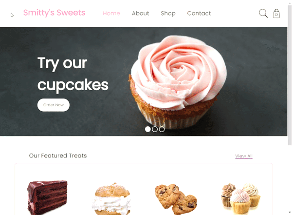

# Bakery Website

## General Info
**Note: This project is still in progress.**

This is a responsive website for an example company, Smitty's Bakery. Pages include the Home, About, Shop (product page), and Contact page. 

## Technologies
* React JS
* SASS

## What's Next
As this project is still in progress, there are still many things to implement. This includes the Contact page, which would have a working form where users can send a message to an email through the site. Shopping cart functionality also needs to be implemented, where users can add products from the shop page to their cart.

## Running the project locally
>## Getting Started with Create React App
>
>This project was bootstrapped with [Create React App](https://github.com/facebook/create-react-app).
>
>### Available Scripts
>
>In the project directory, you can run:
>
>### `npm start`
>
>Runs the app in the development mode.\
>Open [http://localhost:3000](http://localhost:3000) to view it in the browser.
>
>The page will reload if you make edits.\
>You will also see any lint errors in the console.
